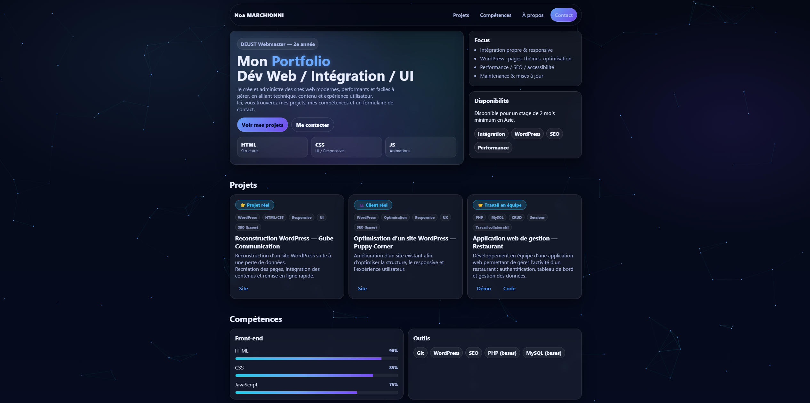

🇬🇧 English version available below.
👉 [English Version](#english-version)

🇫🇷 Version française disponible ci-dessous.  
👉 [Version Française](#version-française)

## English Version
# 🌐 Portfolio — Noa Marchionni

Selected projects demonstrating my skills in web development and digital environments.

👉 Visit the website: https://noamar5.github.io/portfolio/

---

## 🛠 Technologies Used

- HTML5  
- CSS3  
- JavaScript  
- Email integration  
- Git / GitHub  

---

## 🚀 About Me

Second-year Web Development & Digital Communication student, specializing in building reliable, high-performance, and user-friendly websites.

---

## 📩 Contact

Interested in my profile?

👉 Contact me via the form on my portfolio  

or  

👉 Connect with me on LinkedIn:  
https://www.linkedin.com/in/noa-marchionni-74a326387/

## Version Française
# 🌐 Portfolio — Noa Marchionni

Portfolio professionnel présentant mes projets, compétences et mon approche du métier de webmaster.

👉 Voir le site : https://noamar5.github.io/portfolio/

---

## 🛠️ Technologies utilisées

- HTML5  
- CSS3  
- JavaScript  
- EmailJS  
- Git / GitHub  

---

## 🚀 À propos de moi

Étudiant en DEUST Webmaster, je me spécialise dans la création et l’administration de sites web fiables, rapides et faciles à gérer.

---

## 📩 Contact

Si mon profil vous intéresse :

👉 Contactez-moi via le formulaire de mon portfolio  
ou  
👉 Sur LinkedIn : https://www.linkedin.com/in/noa-marchionni-74a326387/
